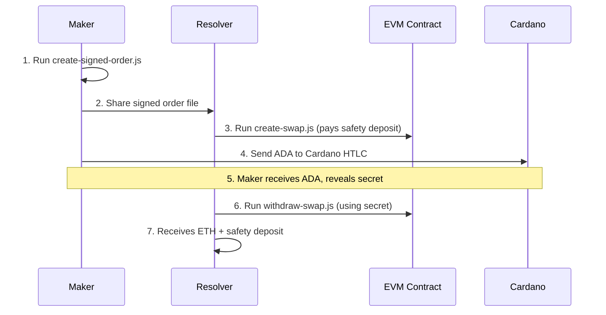

# ETH ↔ Cardano ADA Atomic Swap Scripts

This directory contains scripts for facilitating atomic swaps between ETH on EVM chains and ADA on Cardano.

## Scripts Overview

### 1. `create-signed-order.js` - Maker Creates & Signs Order
The maker (person who wants to swap ETH for ADA) uses this script to create and sign a swap order.

### 2. `create-swap.js` - Resolver Creates Swap
The resolver uses this script to create the actual swap using the maker's signed order. The resolver pays the safety deposit and gas fees.

### 3. `withdraw-swap.js` - Resolver Withdraws ETH
After the maker receives ADA on Cardano and reveals the secret, the resolver can withdraw the ETH from the escrow.

## Workflow



## Usage Instructions

### Prerequisites

1. Deploy the contracts first:
   ```bash
   npx hardhat run scripts/deploy-escrow-factory.js --network <network>
   ```

2. Make sure you have sufficient ETH:
   - **Maker**: Needs ETH to swap + gas for approvals
   - **Resolver**: Needs ETH for safety deposit + gas fees

### Step 1: Maker Creates Signed Order

```bash
npx hardhat run scripts/create-signed-order.js --network <network>
```

**What it does:**
- Creates a swap configuration (edit `swap-config.json` to customize)
- Generates a secret and hashlock
- Signs the order with maker's private key
- Saves signed order and secret files

**Files created:**
- `orders/signed-order-<network>.json` - Share this with resolver
- `secrets/secret-<hash>-<network>.json` - Keep this private until ADA received
- `swap-config.json` - Configuration file (edit as needed)

### Step 2: Resolver Creates Swap

```bash
npx hardhat run scripts/create-swap.js --network <network>
```

**What it does:**
- Loads the signed order from maker
- Verifies the maker's signature
- Checks maker's ETH balance
- Creates the source escrow (calls `createSrcEscrow`)
- Pays ETH amount + safety deposit to the escrow

**Requirements:**
- Resolver needs ETH for safety deposit + gas fees
- Signed order file must exist in `orders/` directory

### Step 3: Maker Sends ADA on Cardano

The maker should now:
1. Create a corresponding HTLC on Cardano with the same hashlock
2. Send the agreed ADA amount to that HTLC
3. Once ADA is locked, share the secret with the resolver

### Step 4: Resolver Withdraws ETH

```bash
npx hardhat run scripts/withdraw-swap.js --network <network> <orderHashPrefix>
```

**What it does:**
- Loads the swap info and secret
- Verifies the secret matches the hashlock
- Withdraws ETH from the escrow
- Returns safety deposit to resolver

**Example:**
```bash
# If order hash starts with "0xa1b2c3d4..."
npx hardhat run scripts/withdraw-swap.js --network sepolia a1b2c3d4
```

## Configuration

### Swap Parameters (`swap-config.json`)

```json
{
  "ethAmount": "100000000000000000",    // 0.1 ETH in wei
  "adaAmount": "100",                   // 100 ADA
  "cardanoAddress": "addr1...",         // Cardano address to receive ADA
  "resolver": "0x0000...",              // Resolver address (0x0000 = any)
  "safetyDeposit": "10000000000000000", // 0.01 ETH safety deposit
  "nonce": 123456,                      // Unique nonce
  "deadline": 1640995200                // Unix timestamp deadline
}
```

### Network Configuration

The scripts work with any EVM network supported by Hardhat. Make sure to:

1. Configure your network in `hardhat.config.js`
2. Deploy contracts to that network first
3. Have sufficient ETH for gas and safety deposits

## File Structure

```
contracts/evm/
├── scripts/
│   ├── create-signed-order.js
│   ├── create-swap.js
│   ├── withdraw-swap.js
│   └── deploy-escrow-factory.js
├── orders/
│   └── signed-order-<network>.json
├── secrets/
│   └── secret-<hash>-<network>.json
├── swaps/
│   └── swap-<hash>-<network>.json
├── deployments/
│   └── addresses-<network>.json
└── swap-config.json
```

## Security Considerations

1. **Keep secrets safe**: Never share the secret file until you've received ADA
2. **Verify addresses**: Double-check all addresses before signing
3. **Check balances**: Ensure sufficient funds before starting swaps
4. **Time limits**: Be aware of deadline constraints
5. **Gas costs**: Factor in gas costs for all operations

## Troubleshooting

### Common Issues

1. **"Insufficient maker ETH balance"**
   - Maker needs enough ETH for the swap amount

2. **"Insufficient resolver balance"**
   - Resolver needs ETH for safety deposit + gas

3. **"Invalid signature"**
   - Order may be corrupted or tampered with

4. **"No secret found"**
   - Maker hasn't shared the secret yet

5. **"Order has expired"**
   - Create a new order with a later deadline

### Getting Help

If you encounter issues:
1. Check the error messages carefully
2. Verify all file paths and permissions
3. Ensure contracts are deployed correctly
4. Check network configuration and balances

## Example Complete Flow

```bash
# 1. Deploy contracts (one time)
npx hardhat run scripts/deploy-escrow-factory.js --network sepolia

# 2. Maker creates order
npx hardhat run scripts/create-signed-order.js --network sepolia

# 3. Maker shares signed-order-sepolia.json with resolver

# 4. Resolver creates swap
npx hardhat run scripts/create-swap.js --network sepolia

# 5. Maker locks ADA on Cardano and shares secret

# 6. Resolver withdraws ETH
npx hardhat run scripts/withdraw-swap.js --network sepolia a1b2c3d4
```

This completes the ETH → ADA atomic swap process!
